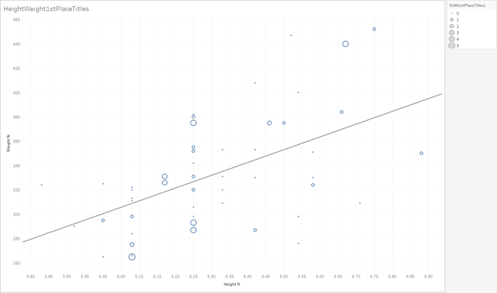
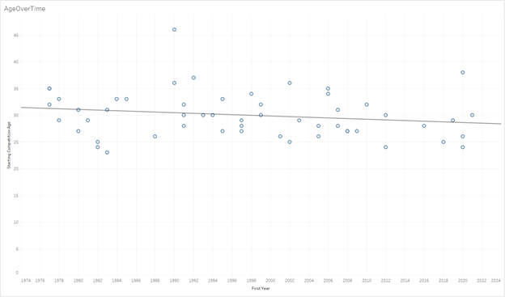

Most data pulled from Wikipedia or StrongmanArchives. Some pulled from old video recordings of the competitions themselves. 

There are a lot of interesting analyses in the Tableau workbook. Below are snippets of some more interesting ones.

Weight and height correlated with the sum of a person’s 1st place wins. Bigger dots mean more wins. You can see that there seems to be a “sweet spot”, from around 6ft1 to 6ft4, and 260lb to 380lb, where most of the bigger circles lie. Still, there are outliers, and the trendline does not account for the number of wins, just the location of one, so it is not weighted appropriately.

Competitor age correlated with WSM year. Interestingly, we see that the age of competitors has decreased over time. This is likely due to WSM becoming a more popular sport over the years, and competitors beginning training earlier.

Height and weight correlated with WSM year. We see a rough positive correlation for both. Competitors seem to have gotten taller over time, as well as heavier.
